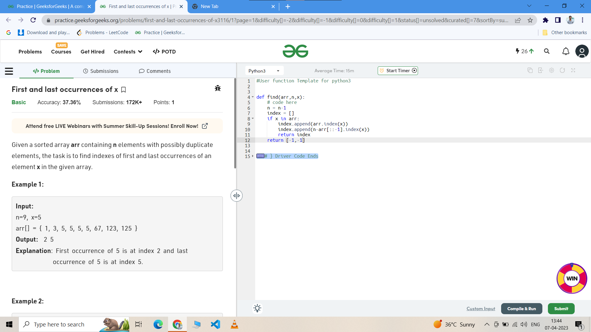
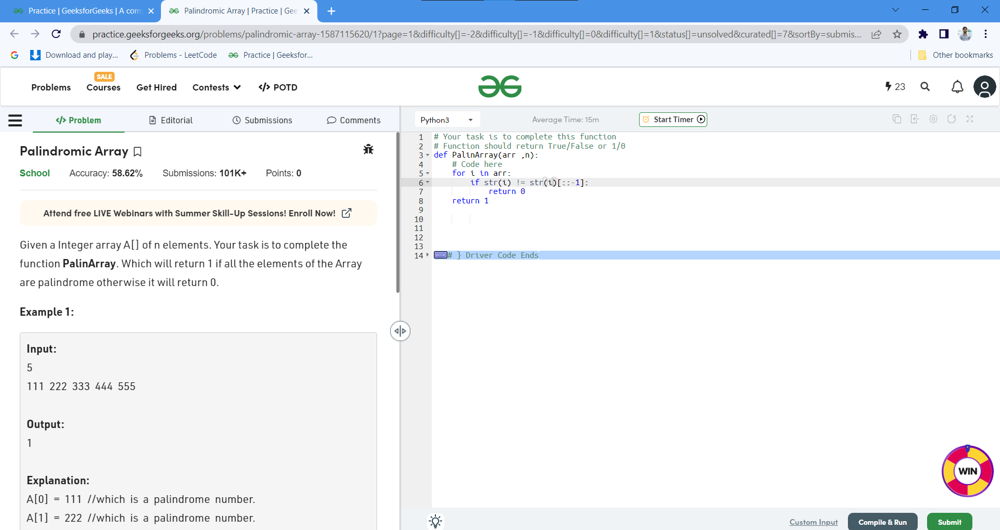

# 100DaysOfCode
100 Days Coding Challenge GeeksForGeeks

## Day 1 : Minimum Integer 

## Day 2 : 
### Problem 1 - Reverse the words of a string

### Problem 2 - Missing Number in Array

## Day 3 : 
### Problem 1 -  Sort an array of 0s, 1s and 2s

### Problem 2 - Find duplicates in an array

## Day 4 : 
### Problem 1 - Parenthesis Checker 

## Day 5 : 
### Problem 1 - Reverse String 

### Problem 2 - Palindrome String 

## Day 6 : 
### Problem 1 - Common Element 

### Problem 2 - Divisibility By 11

## Day 7 : 
### Problem 1 - Union of Two array

### Problem 2 - Power of two

### Problem 3 - Search an element in an array

## Day 8 : 
### Problem 1 - Find minimum and maximum element in an array

### Problem 2 - Value equal to index value

### Problem 3 - Cyclically rotate an array by one

## Day 9 : 
### Problem 1 - Implement queue using array

## Day 10 : 
### Problem 1 - First and last occurence of x

## Day 11 : 
### Problem 1 - Implement Stack using array

## Day 12 : 
### Problem 1 - Palindromic Array

